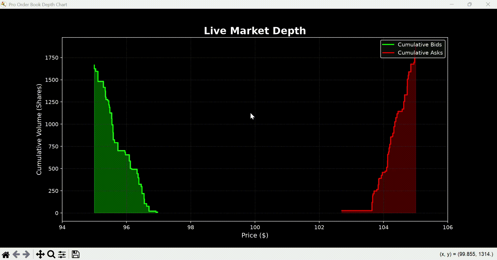

#Ultra-Low Latency Trading Engine

A High-Frequency Limit Order Book (LOB) trading engine built from scratch in C++, featuring a custom memory pool and a Python Pybind11 bridge for live visualization.

## 🚀 Architecture Highlights
* **Core Engine:** $O(1)$ algorithmic matching using Doubly-Linked Lists and Hash Maps.
* **Memory Management:** Zero-allocation architecture via a pre-allocated C++ Object Pool to bypass OS latency.
* **The Bridge:** Statically linked Pybind11 wrapper translating C++ memory directly to Python.
* **Visualization:** Optimized, live-updating cumulative market depth dashboard using Matplotlib.

## 📊 Performance
* **Throughput:** ~7,000+ orders/second (End-to-End via Python loop)
* **End-to-End Latency:** ~142 microseconds per order 

## 🛠️ Tech Stack
* **C++20** (MinGW / GCC)
* **Python 3**
* **Pybind11**
* **Matplotlib**